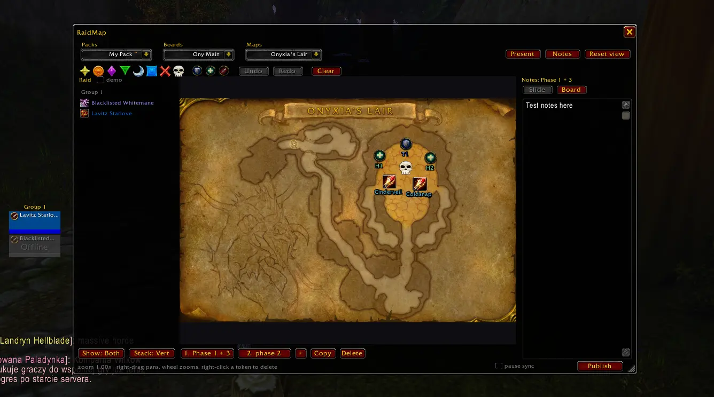

# RaidMap

An easy-to-use WoW addon for managing visual raid assignments on maps.

Put markers, role tokens and your
raiders' names on the game's own maps, split a fight into slides, write notes beside them, and share the pack to your raid (or export online).

Works on **WoW Forever** (1.60.x) and **TBC Anniversary** (2.5.x) and from the same download.

> Still testing heavily. Please [submit bugs here!](https://github.com/brucestarlove/RaidMap/issues)

## Install (.zip)

> Soon submitting to CurseForge.

1. On the [releases page](../../releases), download **`RaidMap.zip`** from the
   newest release. Not "Source code (zip)", which is listed right beside it:
   that one unpacks to a folder the game will not load.
2. Unzip it into your AddOns folder. The zip already contains a folder named
   `RaidMap`, so you should end up with:
   - WoW Forever beta: `World of Warcraft\_classic_beta_\Interface\AddOns\RaidMap\RaidMap.toc`
   - TBC Anniversary: `World of Warcraft\_anniversary_\Interface\AddOns\RaidMap\RaidMap.toc`
3. Restart the game. A `/reload` does not pick up a newly installed addon.

The folder has to be called exactly `RaidMap` and sit directly in `AddOns`. If
yours is called `RaidMap-main` or `RaidMap-<something>`, you have one of
GitHub's source downloads; rename it to `RaidMap`. If Windows' "Extract All"
wrapped it in a second folder, move the inner `RaidMap` up into `AddOns`.

## Using it

Type `/rm` (or `/raidmap`) to open the editor.

- **Pack > Board > Slide.** A pack is what you share ("BT guild"), a board is
  one boss, a slide is one phase. The three dropdowns across the top pick the
  pack, the board and the map; the strip under the map holds the slides.
- **Tokens.** Click a raid marker or a role icon in the toolbar to add it at
  the centre of the view, or drag it onto the map. Drag names out of the raid
  list on the left the same way. Role tokens number themselves (T1, T2, H1...)
  and mean the same thing to anyone you share with; names only mean something
  to your own raid.
- **Mouse.** Left-drag moves a token, right-click deletes it. Right-drag pans
  the map and the wheel zooms. Each slide remembers its own framing.
- **Notes** sit beside the map, per slide or for the whole board.
- **Present** opens a compact read-only view, which is what raiders want open:
  it cannot be edited by accident and it follows whoever is presenting.

### Sharing

- **In your raid or party:** the leader and assistants press **Publish**.
  Everyone with the addon receives the pack, and follows along as the
  presenter changes slides.
- **Anywhere else:** the pack menu has **Export string** and **Import
  string** for pasting through Discord, and **Link in chat** for a clickable
  link that fetches the pack from you.

### Commands

| Command | What it does |
| --- | --- |
| `/rm` | Open or close the editor |
| `/rm present` | Open or close the read-only view |
| `/rm publish` | Send the current pack to your group |
| `/rm restore` | Bring back the pack that the last incoming update replaced |
| `/rm reset` | Put the window back in the middle of the screen at its default size |

## Credits

Created by *Lavitz Starlove*.

RaidMap bundles these libraries, each under its own licence: LibStub and
ChatThrottleLib (public domain), CallbackHandler-1.0, AceDB-3.0 and AceComm-3.0
(Ace3), LibSerialize (MIT), LibDeflate (LGPL 3) and LibUIDropDownMenu.
